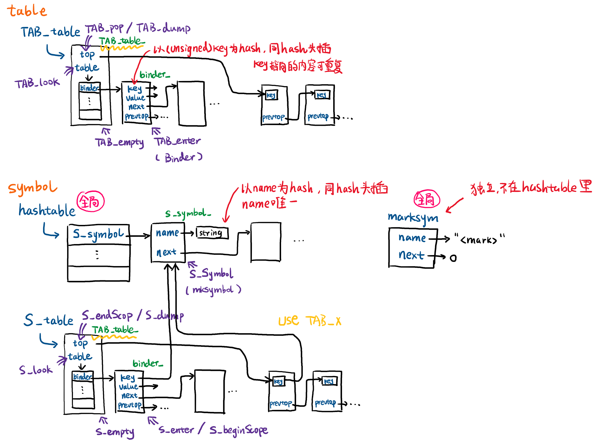

# 如何debug

## lex&yacc

- lex：肉眼看正则表达式对不对，不确定的可以问chatGPT
- yacc：
  - 将 `BISON_TARGET(parser parser.yacc ${PROJECT_BINARY_DIR}/include/frontend/parser.c)`替换为 `BISON_TARGET(parser parser.yacc ${PROJECT_BINARY_DIR}/include/frontend/parser.c COMPILE_FLAGS -v)`，make后会在build/include/frontend文件夹下找到parser.output文件，可以检查语法冲突
  - 可以删除fdmj的部分内容来调试，删了哪些编译通过了就说明哪些地方解析的有问题
  - AST树接的对不对可以通过print_ast的相关函数来检查

## .h和.c文件

- 没有断点调试，也不用gdb，只需在你认为需要打断点的地方用 `fprintf(stderr, ...)`输出想要的debug信息即可，推荐做法是用宏定义包起来，这样de完bug后只需取消宏定义即可，无需删除输出语句

  ```c
  #define __DEBUG
  // #undef __DEBUG

  ...

  #ifdef __DEBUG
    fprintf(stderr, ...);
  #endif
  ```
- 遇到segmentation fault后，发现文件是空的怎么办？在 ` fprintf(out, ...)`后使用 `fflush(out)`能把段错误之前的内容及时输出。

# git代码管理

远程仓库认准master分支，本地开发时自行建立分支以便远程更新后merge

# table和symbol讲解



## TAB_table

通用的指针散列表，映射一个void\*类型的key到一个void\*类型的value。

因为到处使用void\*很容易导致程序错误，所以通过S_table包装，key是S_symbol，value是类型或值。

## S_symbol

对字符串的封装。

它最主要的功能就是，通过存储S_symbol对象链表的hashtable数组，使得任意一个给定字符串的所有不同出现都被转换成同一个S_symbol对象。

这样设计S_symbol是为了方便string的比较，相当于比内容：因为C里的string的等于比的是地址（字符数组），就算内容一样但地址不一样也返回不相等；而sym直接比，内容一样就是一样，因为所有一样内容的string都映射到同一个sym。

## S_table（TAB_table的包装）

命令式风格的数据结构，构造函数式风格的环境。

我们想要构造的是一个函数式风格的环境，即每次对key所映射的value的修改，能够不破坏原有的key-value的binding。对于我们的编程来说，key就是S_symbol（映射到某个字符串，代表某个常量、变量、类、函数等），value可以表示不同的用途（类型绑定用于类型；值绑定用于变量和函数等）。

对此，我们通过S_table来实现：

1、对key进行hash，通过链表头插，只shadow，不destroy

2、维护一个类似栈的结构（TAB_table中的top指针+binder中的prevtop指针），当想要撤销shadow时，能够不断pop

3、至于shadow和pop多少（某个scope的范围，可嵌套），通过一个特殊的binder（marksym）和相应的接口来实现（beginScope压入marksym至栈；endScope从栈中弹出binder直至遇到marksym）

以上，我们为了shadow binding，修改了S_table，是破坏性的，是命令式的风格；但是，我们没有destroy binding本身，也就是创造了函数式风格的环境！

值得注意的是，虽然binding可以表示不同的绑定内容，但是使用时，在任何给定的S_table中，要么所有的binding都应当是类型绑定，要么所有的binding都应当是值绑定。

# hw1注意事项

- test4.fdmj：源程序看起来是有歧义的，但是到AST是没有歧义的，请按照老师PPT上所说的进行llvm ir的生成，结果应该是5和11（请思考为什么，可以写在报告中）
- putint(e1,e2)：等价于putint(e1); putint(e2);（请思考与先计算e1、e2再打印的区别，可以写在报告中）
- 每次翻译putint为llvm ir时，不仅要call putint，还要跟一个call putch(10)输出换行
