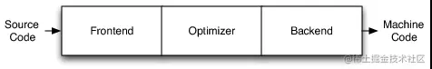
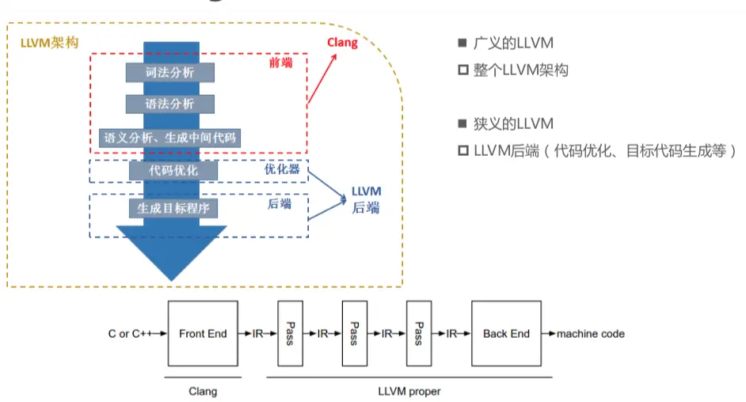
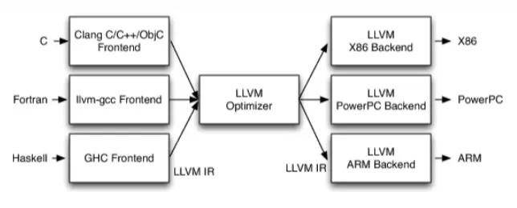
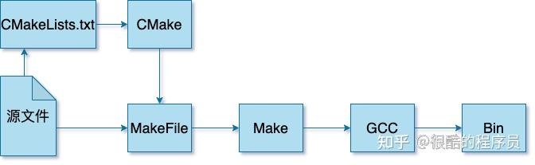

# lab1 环境配置+项目介绍+编译工具

# 环境配置

请课后按照如下步骤进行环境配置。配置过程中如果出现问题（极小概率^^）请问chatGPT。

## 基本环境

Ubuntu20.04 LTS

- 【推荐】安装Windows的Linux子系统wsl：[Windows10/11 三步安装wsl2 Ubuntu20.04（任意盘） - 知乎 (zhihu.com)](https://zhuanlan.zhihu.com/p/466001838)
- 【替代方案】安装VMWare+Ubuntu20.04：[2020最新版VMware安装Ubuntu20.04教程(巨细)！ - 知乎 (zhihu.com)](https://zhuanlan.zhihu.com/p/141033713)

## 工具依赖

- 安装gcc-10和g++-10（用于编译c程序）

  ```bash
  sudo apt update
  sudo apt upgrade
  sudo apt install gcc-10 g++-10
  # 将安装 GCC 10 版本作为可选的 gcc 编译器，并设置它为默认
  sudo update-alternatives --install /usr/bin/gcc gcc /usr/bin/gcc-10 100 --slave /usr/bin/g++ g++ /usr/bin/g++-10
  # (可选) 用于在 Ubuntu 系统中切换系统中已安装的多个软件版本之间的默认选择
  sudo update-alternatives --config gcc
  ```
- 安装lex-2.6.4和yacc-3.5.1（用于编译器的词法分析和语法分析）

  ```bash
  sudo apt-get install flex bison # 这里采用自动安装
  lex --version # flex 2.6.4
  Yacc --version # bison (GNU Bison) 3.5.1
  ```
- 安装clang-14和llvm-14（需要14版本或以上，用于执行.ll文件，同时使用--opaque-pointer）

  ```bash
  # clang-14和llvm-14 (Unbuntu22版本会自动安装最新版，但Unbuntu20版本需要手动安装)
  wget -O - https://apt.llvm.org/llvm-snapshot.gpg.key | sudo apt-key add -
  sudo add-apt-repository "deb http://apt.llvm.org/focal/ llvm-toolchain-focal-14 main"
  sudo apt-get update
  sudo apt-get install clang-14
  sudo apt-get install llvm-14
  clang-14 -v
  lli-14 --version
  ```
- 安装Cmake（需要3.20.0版本或以上，用于项目构建）

  ```bash
  # Cmake3.20.0 (Unbuntu22版本会自动安装最新版，但Unbuntu20版本需要手动安装)
  cd $HOME
  sudo apt update
  sudo apt install -y libssl-dev
  wget https://github.com/Kitware/CMake/releases/download/v3.20.0/cmake-3.20.0-linux-x86_64.tar.gz
  tar -xzvf cmake-3.20.0-linux-x86_64.tar.gz
  echo 'export PATH="$HOME/cmake-3.20.0-linux-x86_64/bin:$PATH"' >> ~/.bashrc
  source ~/.bashrc
  cmake --version
  ```
- 安装Ninja（用于快速运行CMake）

  ```bash
  sudo apt-get install ninja-build
  ```
- 安装交叉编译器（用于将汇编语言转变为arm机器码）

  ```bash
  cd ~/software
  # 下载 gcc-arm-8.2-2018.11-x86_64-arm-linux-gnueabihf.tar.xz
  wget https://armkeil.blob.core.windows.net/developer/Files/downloads/gnu-a/8.2-2018.11/gcc-arm-8.2-2018.11-x86_64-arm-linux-gnueabihf.tar.xz
  tar xf gcc-arm-8.2-2018.11-x86_64-arm-linux-gnueabihf.tar.xz
  echo "export PATH=~/software/gcc-arm-8.2-2018.11-x86_64-arm-linux-gnueabihf/bin:$PATH" >> ~/.bashrc
  # 重启终端，然后查看版本
  arm-linux-gnueabihf-g++ -v
  ```
- 安装qemu模拟器（用于执行交叉编译出的arm机器码）

  ```bash
  sudo apt install ninja-build pkg-config libglib2.0-dev
  cd ~/software
  # 下载 qemu-6.2.0.tar.xz
  wget https://download.qemu.org/qemu-6.2.0.tar.xz
  tar xf qemu-6.2.0.tar.xz
  cd qemu-6.2.0
  mkdir build
  cd build
  ../configure --target-list=arm-linux-user
  make -j4
  sudo make install
  qemu-arm --version
  ```
- 安装zip（用于打包作业）

  ```bash
  sudo apt install zip
  ```

## Vscode插件（按需）

- C/C++ Extension Pack：C/C++开发全家桶
  - 注意 `.vscode/c_cpp_properties.json`文件的编写，有助于识别头文件避免报错
- CMake：cmake高亮
- Yash：lex/yacc高亮
- LLVM Syntax Highlighting：llvm高亮
- Git Graph：git开发可视化
- ...（自己在编码过程中搜索更多方便的插件）

# 项目简介

使用C语言，基于虎书的编译器框架，实现针对FDMJ（FuDan Mini Java）语言的编译器。本编译器拥有：

- 1个前端：将FDMJ生成Tiger IR+；
- 2个后端：分别将Tiger IR+生成LLVM IR和ARM assem并可执行

## 项目网址

文档及代码的更新使用git管理，gitee托管（避免翻墙）：https://gitee.com/fudanCompiler/2024【私密仓库，请联系助教邀请入内】

## 项目结构

我们的编译器仿照gcc三段式的设计



- Frontend（前端）：词法分析、语法分析、语义分析、生成中间代码
- Optimizer（优化器）：中间代码优化
- Backend（后端）：生成机器码

我们的项目结构模仿llvm-project（非常著名的一个编译项目）

```tree
.
├── build CMake命令构建产生的文件夹
│   └── ...
├── docs 实验文档、阅读材料、示例代码等
│   └── ...
├── include 头文件
│   ├── backend 编译器后端
│   │   ├── arm arm后端
│   │   │   └── ...
│   │   └── llvm llvm后端
│   │       └── ...
│   ├── frontend 编译器前端
│   │   └── ...
│   ├── optimizer IR转换与优化
│   │   └── ...
│   └── util 工具文件夹
│       ├── dsa 数据结构与算法
│       │   └── ...
│       └── printer 打印输出用于debug
│           └── ...
├── lib 源文件
│   └── ...(与include文件夹对应的文件结构)
│── test FDMJ测试文件
│   └── ...
│── tools 最终用户的应用程序，即main函数文件
│   └── ...
├── vendor 外部链接库
│   └── ...
├── CMakeLists.txt CMake构建文件
└── Makefile 构建、测试、清理命令
```

## 作业提交

- 作业内容与评分：请按照上述项目结构完成编码，并记录实验过程。每次作业满分为100分
  - 我们会发布样例测试文件（见test文件夹），都通过将获得30的分数；
  - 隐藏测试文件都通过将获得60的分数；
  - 实验过程记录满足以下要求则可获得10的分数：
    - 按开发过程的顺序描述用到的参考材料，包括虎书、网站等，并附上描述与链接；
    - 展示关键技术的实现，简要描述即可；
    - 本地的git提交记录，展示开发过程；
    - 测试通过截图。
- 作业打包与提交：
  - 首先，将你的实验过程记录转换为pdf文件，命名为 `report.pdf`，放在 `docs`文件夹下
  - 然后，进入作业主文件夹（与 `Makefile`同级），输入命令 `make handin`，然后输入你的 `学号-姓名`，则会在 `docs`文件夹下生成需要提交的 `zip`文件
  - 最后，将你的zip文件提交至eLearning相应的作业区

# 编译工具

## gcc/g++/cc/CC

> [编译器 cc、gcc、g++、CC 的区别 - 52php - 博客园 (cnblogs.com)](https://www.cnblogs.com/52php/p/5681725.html)

- gcc 是GNU Compiler Collection，原名为Gun C语言编译器，因为它原本只能处理C语言，但gcc很快地扩展，包含很多编译器（C、C++、Objective-C、Ada、Fortran、Java），可以说gcc是GNU编译器集合。
- g++ 是C++编译器。并不是说gcc只能编译C代码，g++只能编译C++代码，而是两者都可以，只是实现细节上有差别（若有兴趣请见链接）。
- cc 是 Unix系统的 C Compiler，一个是古老的 C 编译器。而 Linux 下 cc 一般是一个符号连接，指向 gcc；可以通过 $ ls -l /usr/bin/cc 来简单察看，该变量是 make 程序的内建变量，默认指向 gcc 。 cc 符号链接和变量存在的意义在于源码的移植性，可以方便的用 gcc 来编译老的用cc编译的Unix软件，甚至连 makefile 都不用改，而且也便于 Linux 程序在 Unix下 编译。
- CC 则一般是 makefile 里面的一个名字标签，即宏定义，表示采用的是什么编译器（如：CC = gcc）。

## gcc/clang/llvm

> [【编译原理】GCC/Clang/LLVM的区别与联系 - 掘金 (juejin.cn)](https://juejin.cn/post/6946088617617915918)
>
> [深入浅出让你理解什么是LLVM - 简书 (jianshu.com)](https://www.jianshu.com/p/1367dad95445)

gcc ≈ clang + llvm



gcc的前端和后端没分得太开，前端后端耦合在了一起。所以gcc为了支持一门新的语言，或者为了支持一个新的目标平台，就变得特别困难


LLVM (Low Level Virtual Machine) 的出现正是为了解决编译器代码重用的问题，不同的前端后端使用统一的中间代码LLVM IR (LLVM Intermediate Representation)
- 如果需要支持一种新的编程语言，那么只需要实现一个新的前端
- 如果需要支持一种新的硬件设备，那么只需要实现一个新的后端
- 优化阶段是一个通用的阶段，它针对的是统一的LLVM IR，不论是支持新的编程语言，还是支持新的硬件设备，都不需要对优化阶段做修改



## gcc/makefile/cmake

> Makefile：[Makefile教程（绝对经典，所有问题看这一篇足够了）-CSDN博客](https://blog.csdn.net/weixin_38391755/article/details/80380786)
>
> CMake基础：[CMake 良心教程，教你从入门到入魂 - 知乎 (zhihu.com)](https://zhuanlan.zhihu.com/p/500002865)
>
> CMake实战：[cmake-tutorial: CMake学习^^ (gitee.com)](https://gitee.com/demon0511/cmake-tutorial)
>
> CMake进阶：[Introduction - 《CMake菜谱（CMake Cookbook中文版）》 - 书栈网 · BookStack](https://www.bookstack.cn/read/CMake-Cookbook/README.md)

演进：bash脚本 → Makefile → Makefile+CMake



- bash脚本：执行.c文件前，首先要把源文件编译成.o中间代码文件（Object File），然后再把大量的.o文件链接成.exe可执行文件。这个过程通过若干gcc命令来完成。一个简单的做法是编写.sh文件，一般来说需要构建 `build.sh`、运行 `run.sh`、清理 `clean.sh`等脚本。

- Makefile
  - 起到汇总脚本的效果，可以看作.sh文件的多合一。
  - 其另一个用处是简化构建过程。当需要编译的东西很多时，需要说明先编译什么，后编译什么，这个过程称为构建。Makefile能自动找到依赖关系，我们就无需按顺序写命令编译文件；并且，Makefile还会根据文件更新的时间以及依赖关系，避免重新编译无需再编译的文件。

- CMake：能进一步简化构建过程，但无法替代Makefile作为.sh文件的多合一，因此通常的做法是Makefile单单将构建过程建委托给CMake。此外，Makefile的构建会将中间文件和代码文件混在一起，而CMake能分离它们。

本项目使用Makefile调用CMake进行构建，测试、清理等命令都集成在Makefile中。以下介绍一些常见的语法。

### gcc

- gcc（GNU Compiler Collection）将源文件编译（Compile）成可执行文件或者库文件
- 常见编译命令为：
  - 无选项：生成可执行文件a.out
  - `-o`：生成指定名称的可执行文件
  - `-E`：.c预处理为.i
  - `-S`：.c或.i汇编为.s
  - `-c`：.c或.i或.s编译为.o
  - `-O`：级别为1~3，级别越大优化效果越好，但编译时间越长。
  - `-g`：产生一个可调试的可执行文件。通常情况下，开发一个程序的时候我们经常使用 -g ，但是我们在编译一个“release版本” 的程序的时候，如果程序工作得让人满意了，我们就不使用 -g 编译。

### Makefile

- 语法：本质上是一个文件的依赖关系，也就是说，target这一个或多个的目标文件依赖于prerequisites中的文件，如果prerequisites中有一个以上的文件比target文件要新的话，command所定义的命令就会被执行。

  ```makefile
  target... : prerequisites …
    command
    ...
    ...
  ```

  - target也就是一个目标文件：可以是Object File，也可以是执行文件，还可以是一个标签（Label）。
  - prerequisites就是，要生成那个target所需要的文件或是目标。
  - command也就是make需要执行的命令（任意的Shell命令）。
- 命令

  - `make`默认执行第一个target
  - `make fake_target`指定执行某个.PHONY指定的伪目标
- 一些重要的知识点（欢迎补充，建议每次遇到新的时自行查阅网络资料，“知其所以然”）

  - `$`相关的makefile标识符

    - `$@`：目标文件（目标的名字）
    - `$^`：所有的依赖文件（构造所需文件列表所有所有文件的名字）
    - `$<`：第一个依赖文件（构造所需文件列表的第一个文件的名字）
    - `$?`：构造所需文件列表中更新过的文件
    - `$*`：目标模式中“%”及其之前的部分
  - ...

### CMake

- 语法

  - 主文件夹（Makefile同级）

    ```cmake
    # 项目信息
    project(FDMJCompiler)

    # 添加包含路径
    include_directories(include)
    include_directories(${PROJECT_BINARY_DIR}/include)

    # 递归构建
    add_subdirectory(lib)
    add_subdirectory(tools)
    ```
  - 库文件夹（lib）

    ```cmake
    # 遍历目录源文件
    aux_source_directory(dsa UTILS_SRCS)
    aux_source_directory(printer UTILS_SRCS)

    # 生成库文件
    add_library(utils OBJECT ${UTILS_SRCS})
    ```
  - 执行文件夹（tools）

    ```cmake
    # 生成可执行目标
    add_executable(lab2 lab2.c)

    # 添加链接库
    target_link_libraries(lab2 PUBLIC
      frontend
      utils
    )
    ```
- 命令

  - 配置

    ```bash
    cmake -G Ninja -B build
    ```

    - `-G Ninja`: 指定生成 Ninja 构建系统的 Makefile。Ninja 是一个快速且轻量级的构建系统，相比传统的 Makefile，它更高效。
    - `-B build-release`: 指定构建目录为 `build`。
  - 构建

    ```bash
    cd build && ninja
    ```

    - 进入build目录后执行ninja，即开始构建

# 几个建议

- 虎书对应章节请根据课程进度及时阅读，最好做到课前预习，上课就会事半功倍
- 部分lab会提供阅读材料，有助于完成实验或提升你的技能
- 每个lab都有难度，请尽早开始做，不要赶ddl
- 每周花在本编译课的时间估计
  - 理论学习（10~15h）：教材+阅读材料+实验讲义
  - lab实践（5~10h）
